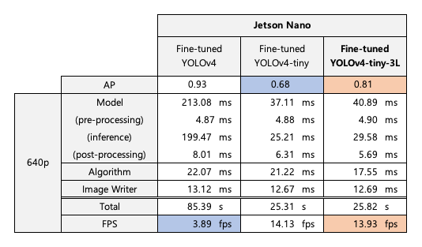
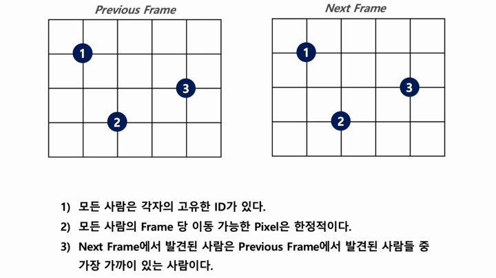

# Social-Distancing Monitoring and Tracking on AI Platform
This is a project which implement high-quality social-distancing monitoring system on NVIDIA Jetson Nano.  
This allows tracking people on the video, categorizing person as 'definite risk' if he/she exceeds a 'threshold time' we set.
  
## Key features
### Model 
</img><br/>  
The runtime on the table above is evaluated with 640 pixel demo video.
Among these models, YOLOv4-tiny-3L showed the best balance between AP and FPS.
  
### TensorRT
(to be updated soon)

### Transfer Learning
Since the model only has to detect human, we did transfer learning of YOLOv4-tiny-3L with crowd-human dataset.  
AP of the model improved.  
(AP/FPS comparison datasheet)  

### Human Tracking Algorithm
</img><br/>

## Usage
```script  
  ## Streaming Mode
  $ python3 trt_yolo.py --model yolov4-tiny-3l-crowd-416 \
                        --video source_video/myvideo.mp4
                        
  ## Saving Mode
  $ python3 trt_yolo_cv.py --model yolov4-tiny-3l-crowd-416 \
                           --video source_video/myvideo.mp4 \
                           --output output_video/myoutputvideo.mp4 \
                           --file output_file/myoutputlog.txt
```
  
## Environment
* Platform: Jetson Nano Developer Kit 4GB
* Camera : Logitech C270 webcam
* Libraries: TensorRT, OpenCV, NumPy, PyCUDA, etc. (version needed)

## Demo Videos
### Tracking People
</img><br/>
  
### Monitoring Social-Distancing
</img><br/>

## Improvements
- [ ] Consider Jetson Xavier as a platform
- [ ] Model Analysis of YOLOv4-tiny-3L
- [ ] Mdoel Optimization of YOLOv4-tiny-3L
- [ ] Algorithm Optimization with GPU Programming
- [ ] Test on Real-time environment
- [ ] Website streaming service using OpenCV, Flask
  
## References
* TensorRT demo code : https://github.com/jkjung-avt/tensorrt_demos
* Crowd-Human Dataset : https://www.crowdhuman.org
* Transfer-Learning demo code : (to be updated soon)
* Social-Distancing using YOLOv5 : https://github.com/ChargedMonk/Social-Distancing-using-YOLOv5
* Social-Distancing Monitoring :  https://github.com/dongfang-steven-yang/social-distancing-monitoring
* Web Streaming from IP camera with Flask : https://gist.github.com/raiever/df5b6c48217df521094cbe2d12c32c66
* OpenCV Stream Video to Web : https://github.com/pornpasok/opencv-stream-video-to-web
