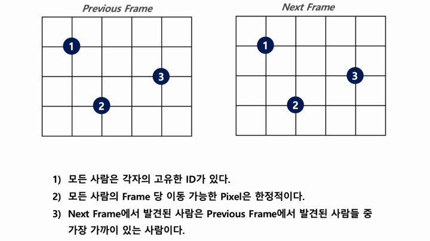

# Social-Distancing Monitoring and Tracking on AI Platform
This is a project which implement high-quality social-distancing monitoring system on NVIDIA Jetson Nano.  
This allows tracking people on the video, categorizing person as 'definite risk' if he/she exceeds a 'threshold time' we set.

## Key features
### Model
YOLOv4  
YOLOv4-tiny  
YOLOv4-tiny-3L  
(AP/FPS comparison datasheet)  
Among these models, YOLOv4-tiny-3L showed the best balance between AP and FPS.
### TensorRT
-
### Transfer Learning
Since the model only has to detect human, we did transfer learning of YOLOv4-tiny-3L with crowd-human dataset.  
AP of the model improved.  
(AP/FPS comparison datasheet)  
### Human Tracking
</img> 

## Environment
* Platform: Jetson Nano Developer Kit 4GB
* Camera : Logitech C270 webcam
* Libraries: TensorRT, OpenCV, NumPy, PyCUDA, etc. (version needed)

## Demo Monitoring

 
## Demo Tracking
</img> 

## References
* TensorRT demo code : https://github.com/jkjung-avt/tensorrt_demos
* Crowd-Human Dataset : 
* Transfer-Learning demo code : 
* Social-Distancing using YOLOv5 : https://github.com/ChargedMonk/Social-Distancing-using-YOLOv5
* Social-Distancing Monitoring :  https://github.com/dongfang-steven-yang/social-distancing-monitoring
